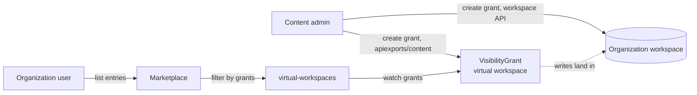

# RFC 010: Controlling discovery and visibility in the Marketplace

| Status  | Proposed   |
|---------|------------|
| Author  | @brsmnv    |
| Created | 2026-08-31 |
| Updated | 2026-08-31 |
| RFC PR  | TBD        |

## Summary

The Platform Mesh marketplace offers managed services to consumer workspaces across different organizations. At the moment every managed service provider (MSP) offering is visible to all tenants.

The platform must enable content administrators to limit visibility and explicitly configure which managed services are available to a particular organization.

## Motivation

At the moment every PM user sees the same set of service provider offerings. There is no way to configure the enabled set and match visible services to the ones intended to be consumed by an organization.


## Context and Problem Statement

Currently the only control mechanism available are the APIExportPolicies ([ADR 002](../adr/002-apiexport-binding-access-control.md)). They back the APIBinding authorization and the set of allowed accounts is consulted at binding time.

Hiding an entry should not cause existing resource instances to become hidden, unavailable or deleted. Discovery and authorization are two orthogonal concepts. A separate resource describing the set of discoverable and visible services is needed.

## Goals

- Configurable for each individual organization.
- The set of entries enabled for an organization can be inspected.
- Organization users can not self-grant.
- Designated users and groups are permitted to create the "grant" resources.

## Non-Goals

- Limit resource binding and creation:
  - No, this is the purpose of APIExportPolicies.
- Allow for configuration at arbitrary depth: 
  - Necessary only at the org level.
- Capability bundles, this is out of scope for this RFC.
- Interaction with defaultAPIBindings:
  - Bindings are created by an initializer with elevated privileges (see KCP authorizers chain).

## Design Principles

- Does not require a privileged (KCP admin, system:masters) identity.
- Minimal cross-module dependencies.
- No assumptions about workspace naming.
- Minimize dependence on mutable workspace paths (prefer logical cluster IDs).

## Proposal

### VisibilityGrant

The resource spec has a single `providers` field. A provider is described by its logical cluster ID, and a list of APIExports in its workspace.

The resource has no status and the desired state is purely inferred from the spec.

Example manifest:
```yaml
apiVersion: marketplace.platform-mesh.io/v1alpha1
kind: VisibilityGrant
metadata:
  name: httpbins-grant
spec:
  providers:
    - providerClusterID: "1x9kmpycm73no0vg"
      apiExports:
        - orchestrate.platform-mesh.io
```

### Use

**Management / Authoring:** Content administrators create the resource into the organization workspace. 

There are two ways to allow the write:
- Directly in the org workspace, through its kcp API endpoint. The write must pass the workspace RBAC *and* the maximal permission policy (MPP) of the VisibilityGrant APIExport.
- Through the APIExport's virtual workspace. This requires write access to the `apiexports/content` subresource in the export workspace. Organization workspace RBAC is not necessary.

**Organizations can not self-grant.** The APIExport sets `maximalPermissionPolicy: local`, and the roles in the export workspace give only the content administrator group the write verbs. 

**Reader / Watcher:** The `virtual-workspaces` service uses the APIExportEndpointSlice of the VG APIExport to retrieve the virtual workspace URL. Grants across every organization that bound the export are watched.

**Enforcing:** The marketplace lister uses the resource on every request. It takes the workspace path from the request, cuts it to the organization level and reads the grant stored there. Entries are filtered by the retrieved grants. The default is no grants and an empty marketplace.




RBAC, all of it in the workspace holding the APIExport:

| Permission | Subject | Purpose |
|---|---|---|
| `visibilitygrants` create, update, patch, delete (through the MPP) | content administrator group | author grants in any organization |
| `visibilitygrants` get, list, watch (through the MPP) | authenticated users | an organization can inspect the grants that apply to it |
| `apiexports/content` write verbs on the VisibilityGrant APIExport | content administrator group | write grants through the virtual workspace, without RBAC in each organization |
| `apiexports/content` read verbs on the VisibilityGrant APIExport | virtual-workspaces service | read grants through the virtual workspace |
| `apiexportendpointslices` get, list, watch | virtual-workspaces service | discover the virtual workspace URL and follow changes to it |

The endpoint slice permission cannot be narrowed to a single resource name. The
service keeps an informer on the slice, and Kubernetes RBAC `resourceNames` does
not apply to list and watch requests.

### Configuration

The workspace for the VisibilityGrants is configurable. The canonical home is configurable through `--visibility-home-pattern` with `root:orgs` as the default. The flag names the parent level in the hierarchy, and resources live in `root:orgs:<org>`.


## Alternatives Considered

### Resource in root:orgs

The first iteration included a design relying on resources in root:orgs. It was rejected for multiple reasons:
- Status fields with resolved IDs (spec fields contained paths), reconciler as a workaround.
- Filtering by org required additional indexing.
- Access to root:orgs, authorization.

### Walking up the workspace tree and aggregating

A similar approach to what this RFC proposes, but with a tree walk to aggregate grants:
- Relied on a privileged identity to access parent workspaces.
- Did not work with sharded clusters. Workspace hierarchies can live in different shards.
- Alternative approach required a permission claim on `core.kcp.io/logicalclusters` in every workspace.

## Drawbacks and Limitations

### Visibility does not guarantee confidentiality

The grant filters a listing and steers service discovery. An organization with e.g. prior knowledge and existing APIExportPolicies can still bind the resources.

### The marketplace Virtual Workspace does not authorize the caller

Theoretically, clients can fetch the Marketplace entries of unrelated workspaces. This is currently blocked by the per-workspace authentication, not by the Marketplace service. There is an existing known gap (TODO in code). Can be addressed independently from this RFC and its implementation.

### Organization level only

A grant covers the organization and every
account below it. There is no way to narrow the visible set for a single account.

### Removing a grant does not remove the resources

This is by design, as retracting marketplace offerings should not result in unmanageable, orphaned or deleted resources. Resource entries still visible in the sidebar as their `APIBinding` still exists.

## Open Questions

1. Rollout for existing environments. Should be part of the v0.6 migration guide.
2. Do we want to support a special "permit all" syntax? Not planned for the MVP and a special wildcard syntax feels out of place.

## Migration / Implementation Roadmap

### Setup
- A VisibilityGrant APIExport is created in `root:platform-mesh-system`. 
- RBAC manifests are created next to the APIExport.
- Each organization using the Marketplace binds the new VisibilityGrant APIPExport.
- Designated content administrators create Visibility Grant resources in target organizations.
- Organization tenants can only see APIExports listed in their grant(s).


## References

- [ADR 002: Fine-Grained Access Control for APIExport Binding](../adr/002-apiexport-binding-access-control.md)
- [RFC 001: API Provider Data and Provider UI Discovery in Platform Mesh](./001-api-providers-and-ui-discovery.md)
- [RFC 004: Core Platform Extendability](./004_core-platform-extendability.md)
